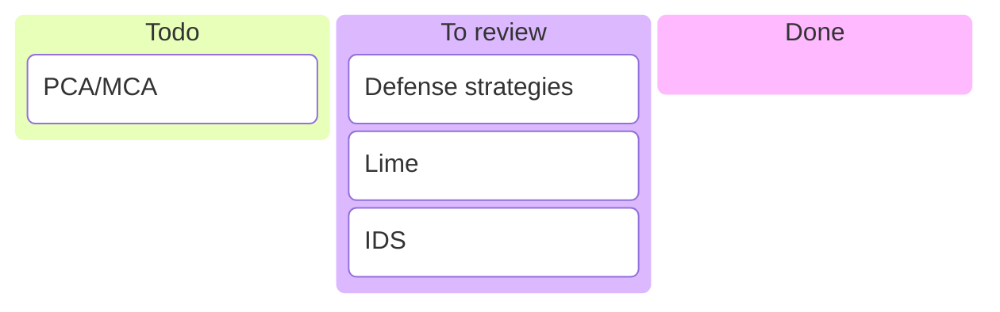
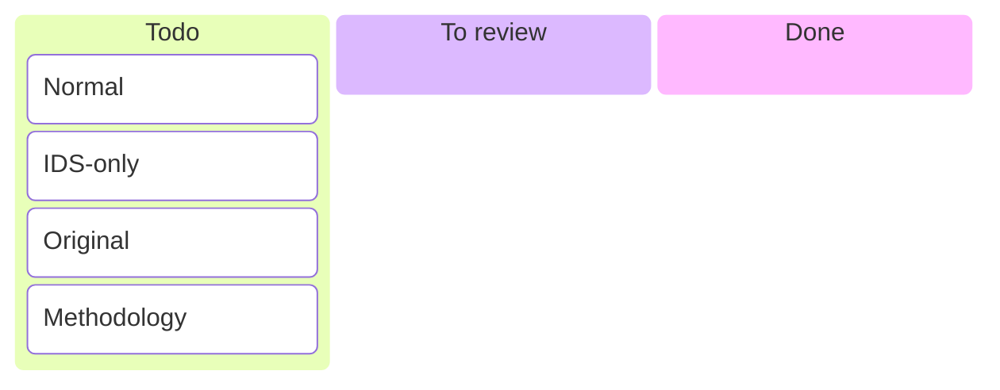

# Main Paper

## Literature Kanban

## Experiments Kanban

## Plan

- [x] titulinis lapas
  - [x]  universiteto, instituto, studijų programos pavadinimai
  - [x]  bakalauro darbo tema lietuvių ir anglų kalbomis
  - [x]  darbo rūšis (t. y. bakalauro baigiamojo darbo planas)
  - [x]  studento vardas ir pavardė
  - [x]  vadovo pareigos, vardas ir pavardė
  - [x]  miestas, metai
- [x] darbo planas
  - [x]  tyrimo objektas ir aktualumas
  - [x]  darbo tikslas
  - [x]  keliami uždaviniai ir laukiami rezultatai
  - [x]  tyrimo metodai
  - [x]  numatomas darbo atlikimo procesas
  - [x]  apibūdinami darbui aktualūs literatūros šaltiniai